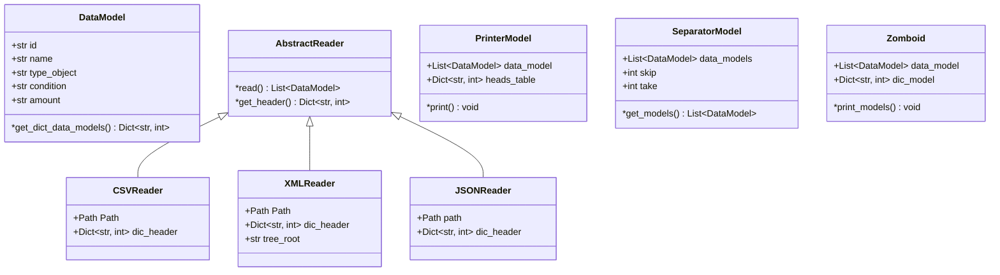

# zomboid

The world is on the brink of a new epidemic. The disease Z32-19 causes irreversible damage to the central nervous system. The main symptoms include: increased aggressiveness, blurred vision, reduced intelligence, hunger and thirst. The disease also causes the body to produce stem cells uncontrollably.
**This app is for the survivor community that helps
keep records of essential items.**

## Class diagrams

